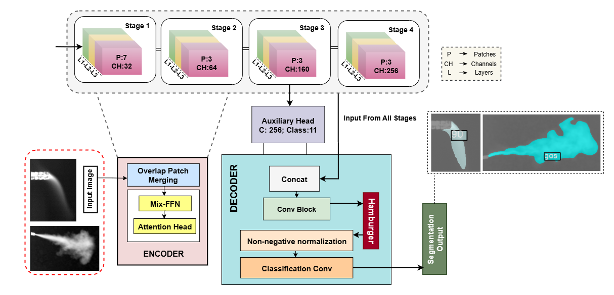

# CarboNeXT and CarboFormer: Dual Semantic Segmentation Architectures for Detecting and Quantifying CO₂ Emissions Using OGI

<a href="https://arxiv.org/abs/2506.05360" target="_blank">
  
</a>

## 📝 Overview

We introduce CarboNeXT and CarboFormer, two novel semantic segmentation frameworks for Optical Gas Imaging (OGI), designed to detect and quantify CO₂ emissions across diverse applications. Our approach integrates multi-scale context aggregation networks with UPerHead and auxiliary FCN components to effectively model both local details and global relationships in gas plume imagery.

**Key Features:**
- **CarboNeXT**: High-performance model achieving 88.46% mIoU on CCR dataset and 92.95% mIoU on RTA dataset at 60.95 FPS
- **CarboFormer**: Lightweight variant with only 5.07M parameters achieving 84.68 FPS with competitive performance (84.88% mIoU on CCR, 92.98% on RTA)
- Real-time monitoring capabilities for environmental sensing and precision livestock management
- Effectiveness in challenging low-flow scenarios for CO₂ emission analysis

## 🏗️ Model Framework

### CarboNeXT


### CarboFormer  


## 🚀 Getting Started

### 📥 Model Installation

**Step 1: Download and Extract the Code**

Download the code package and extract it:

```bash
# Download the code package
wget supplimentery/codes.zip

# Extract the package
unzip codes.zip
cd code
```

**Step 2: Environment Setup**

CarboNext and CarboFormer recommends setting up a conda environment and installing dependencies via pip or conda. Use the following commands to set up your environment:

**💻 Create and activate a new conda environment**

```bash
conda create -n carbonext python=3.8
conda activate carbonext
```

**🔥 Install PyTorch and CUDA**

```bash
conda install pytorch torchvision torchaudio pytorch-cuda=11.8 -c pytorch -c nvidia
```

**🧩 Install MMSegmentation dependencies**

```bash
pip install -U openmim
mim install mmengine
mim install "mmcv>=2.0.0,<2.2.0"
```

### ⚠️ Special Note

> **Important:** After installing mmengine, you should manually change the version of mmcv:
> ```
> mmseg > __init__.py > MMCV_MAX = '2.2.1'
> ```

**📦 Install additional packages**

```bash
pip install matplotlib numpy packaging prettytable scipy
conda install conda-forge::ftfy
conda install conda-forge::tensorboard
pip install wandb
conda install anaconda::ipykernel
```

**🔧 Install the model package**

```bash
pip install -e .
```

### 📊 Dataset Preparation

The model is designed to work with the Co2 dataset. The dataset should be organized in the following structure:

```
data/V4/
├── train/
│   ├── images/
│   └── mmseg_masks/
├── validation/
│   ├── images/
│   └── mmseg_masks/
└── test/
    ├── images/
    └── mmseg_masks/
```

> 💡 **Tip:** Ensure your data path is correctly set in the configuration file or update the `data_root` in `local_configs/_base_/datasets/co2.py`.

### 🏋️ Training

You can train the Carbonext model using either the command line or Jupyter notebooks:

**🖥️ Command Line Training**

```bash
python tools/train.py local_configs/hw_model/carbonext/carbonext_config.py
```

You can customize the training parameters by modifying the configuration file `local_configs/hw_model/carbonext/carbonext_config.py`.

**📓 Jupyter Notebook Training**

We provide a convenient Jupyter notebook for training in the `notebooks` folder:

1. Navigate to the notebooks directory:
   ```bash
   cd notebooks
   ```

2. Launch Jupyter notebook:
   ```bash
   jupyter notebook train.ipynb
   ```

3. In the notebook, you'll need to:
   - Load your configuration file
   - Set the working directory
   - Start the training process

Sample code from the notebook:
```python
from mmengine.config import Config
from mmengine.runner import Runner

# Load configuration
cfg = Config.fromfile('./carbonext.py')

# Set working directory
cfg.work_dir = "work_dirs"
runner = Runner.from_cfg(cfg)

# Start training
runner.train()
```

### 📈 Evaluation

Similarly, you can evaluate the trained model using either the command line or Jupyter notebooks:

**🖥️ Command Line Evaluation**

```bash
python tools/test.py local_configs/hw_model/carbonext/carbonext_config.py /path/to/checkpoint --eval mIoU
```

**📓 Jupyter Notebook Evaluation**

We provide a test notebook in the `notebooks` folder with several evaluation options:

1. Navigate to the notebooks directory:
   ```bash
   cd notebooks
   ```

2. Launch Jupyter notebook:
   ```bash
   jupyter notebook test.ipynb
   ```

3. The notebook contains several cells for different evaluation tasks:

   **Basic Testing:**
   ```python
   !python ../mmsegmentation/tools/test.py \
   carbonext.py \
   work_dirs/best_mIoU_iter_160000.pth \
   --out results/test_images \
   --work-dir work_dirs
   ```

   **Benchmark Performance:**
   ```python
   !python ../mmsegmentation/tools/analysis_tools/benchmark.py \
   carbonext.py \
   work_dirs/best_mIoU_iter_160000.pth
   ```

   **Calculate Model FLOPs:**
   ```python
   !python ../mmsegmentation/tools/analysis_tools/get_flops.py carbonext.py --shape 512 512
   ```

## 📖 Citation

If you use CarboNeXT or CarboFormer in your research, please cite our paper:

```bibtex
@article{islam2025carbonext,
  title={CarboNeXT and CarboFormer: Dual Semantic Segmentation Architectures for Detecting and Quantifying Carbon Dioxide Emissions Using Optical Gas Imaging},
  author={Islam, Taminul and Sarker, Toqi Tahamid and Embaby, Mohamed G and Ahmed, Khaled R and AbuGhazaleh, Amer},
  journal={arXiv preprint arXiv:2506.05360},
  year={2025}
}
```
